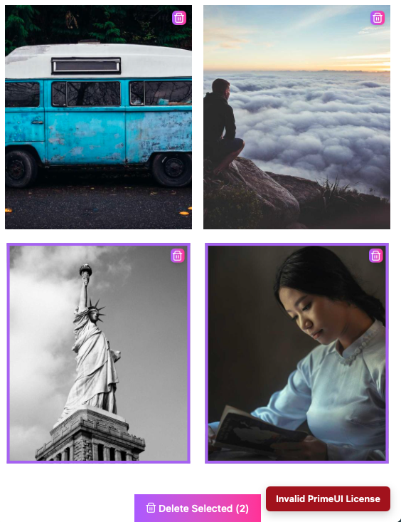

# Angular Images Gallery

A responsive Angular image gallery that adapts to desktop, tablet, and mobile screen sizes while supporting image selection and bulk actions.

## Project overview

This app displays a gallery of images in a clean responsive layout. The gallery responds to the screen width and rearranges the image grid for desktop, tablet, and mobile devices. Users can select one or more images and perform actions such as deletion or other bulk operations.

## How the app works

- The gallery is built with Angular and uses standalone components under `src/app/components`.
- `GalleryComponent` renders the image collection and handles filtering, selection, and responsive layout.
- `ImageItemComponent` displays each image card and exposes selection state for desktop, tablet, and mobile.
- The interface is designed to be usable with touch on mobile and pointer input on larger screens.

## Screenshots

### Desktop

#### Main desktop view


This screenshot shows the default desktop gallery layout with images arranged in a wide grid with a featured image that spans 2 rows and 2 columns.

#### Multiple selection on desktop


This screenshot illustrates how the gallery handles selecting multiple images at once on a desktop viewport and displays the delete button that allows the user to remove the selected images.

#### After deleting images on desktop


This screenshot shows the gallery state after removing one or more selected images.

### Tablet

#### Tablet layout


The tablet screenshot highlights a more compact layout (without the featured image) while preserving selection controls and image visibility.

#### Multiple selection on tablet


This screenshot demonstrates selecting multiple images on a tablet screen size.

### Mobile

#### Mobile layout


The mobile screenshot shows the responsive single-column or narrow grid layout optimized for small screens.

#### Multiple selection on mobile



This screenshot shows the selection mode on mobile, where image cards remain accessible and easy to interact with.

## Run locally

Install dependencies and start the development server:

```bash
npm install
npm start
```

Then open the browser at `http://localhost:4200/`.

## Build

To build the app for production:

```bash
npm run build
```

The compiled output is written to the `dist/` folder.

## Testing

Run unit tests with:

```bash
npm test
```

## Notes

- The README screenshots are stored in `public/readme-files` and are referenced directly from this file.
- The project is structured for Angular development with responsive layout and image selection features.

## License & Credits
Developed by:
- Albert Muntal Perez
- Linkedin: https://www.linkedin.com/in/albert-muntal-perez-a626a0120/
- GitHub: https://github.com/DrMunty